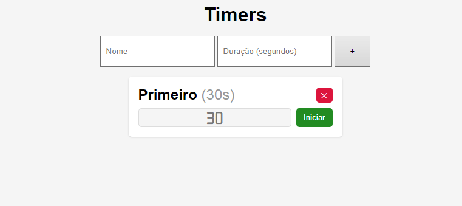

# Timers

#### Sexto projeto do curso de React Direto ao Ponto

## 🎯 Objetivo

Esta é uma aplicação de criação de Cronômetros em React JS, nela é possível criar vários cronômetros ao mesmo tempo, inserindo um nome e um tempo (em segundos), e também remove-los.

## 🚀 Como executar o projeto

1. Clone este repositório

`$ https://github.com/giovanaraphaelli/timers-app.git`

2. Acesse a pasta do projeto no seu terminal/cmd

`$ cd timers-app`

3. Abra a pasta do projeto no VS Code via terminal/cmd

`$ code .`

4. Instale as dependências

`$ yarn install`

5. Execute a aplicação em modo de desenvolvimento

`$ yarn start`

6. A aplicação será aberta na porta: 3000 - acesse http://localhost:3000
